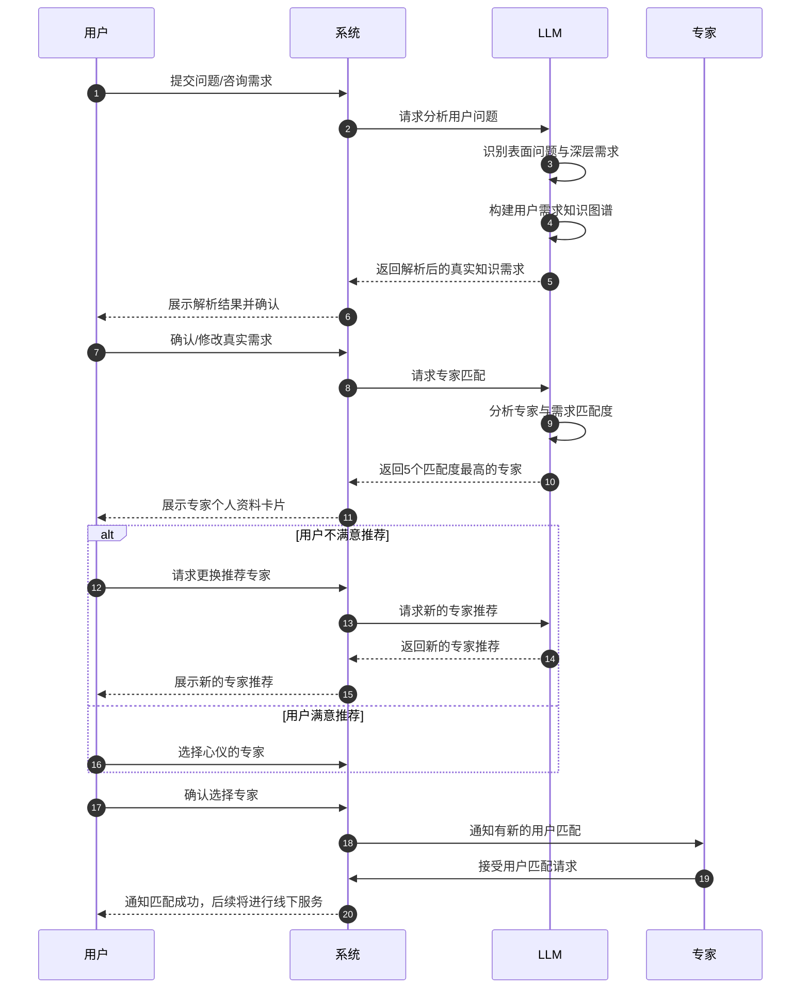
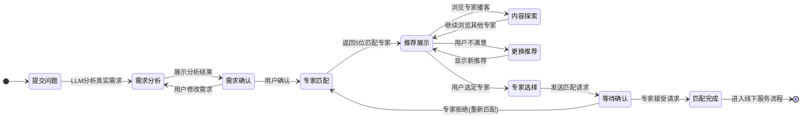

# 产品需求说明书 (PRD)

## 1. 产品概述

### 1.0 核心理念

Brick Talk（中文名：砖家说Pro）是一个专注于AI领域的专家社区平台。平台名称蕴含深意：

- **砖家**：谐音"专家"，同时暗示每个人都可以"抛砖引玉"，贡献自己的见解
- **专家**：平台汇聚真正的行业专家，提供高质量的AI领域洞察
- **Pro**：强调专业性和高品质内容

平台的核心理念是：

1. **人人皆可为师**：每个人都既是专家（在自己擅长领域），也是砖家（为讨论抛砖引玉）
2. **公开学习（Learn in Public）**：鼓励专家在透明分享的环境中更快提高，形成良性循环
3. **专业Show Case**：类似设计师在Dribbble上展示作品，专家在此平台展示其专业洞察和思考

平台持续推送不同专家针对最新AI信息源的评论、笔记、推文、公众号文章和圆桌会议内容。每周都有重量级嘉宾就当周最新的AI资讯和技术前沿做分享，AI技术帮助整理这些分享并推送给高级用户。

高级用户不仅可以获取优质内容，还可以向专家提问，或提出访谈咨询、付费研究、演讲分享、1v1辅导等需求，形成完整的知识服务生态。

### 1.1 产品背景

随着人工智能技术的快速发展，AI领域的信息爆炸式增长，专业人士和爱好者需要一个高质量的平台来获取最新、最有价值的AI行业动态、技术革新和专家观点。传统的信息获取方式存在信息碎片化、质量参差不齐、缺乏深度解读等问题。

### 1.2 产品定位

Brick Talk 中文名 「砖家说Pro」，是一款专注于人工智能（AI）领域的专家社区博客网站。平台旨在构建一个以专家为中心的知识分享空间，让每个人都既可以成为专家（分享自己的洞察和看法），也可以作为砖家（抛砖引玉，引发更深刻的讨论）。平台鼓励专家以"公开学习"（Learn in Public）的模式分享见解，推动专家与用户之间形成良好的互动，共同探索AI行业的最新趋势、技术热点与前沿洞察。

Brick Talk的模式类似于设计领域的 Dribbble 平台，即专家们可在此Show Case自己的专业洞察，建立个人品牌，同时获得与用户互动的机会。专家通过持续分享高质量内容，不仅提升自身影响力，也能从社区反馈中获得成长，形成正向循环。

平台的长期愿景是：
- 成为AI领域最具影响力的专家社区
- 为今后扩展到更广泛的行业专家平台，帮助投研所能够更准确匹配和筛选AI的领域专家，从而不需要平台客服顾问去人工联系、筛选专家
- 建立专家与用户间的高效知识传递渠道，降低优质知识获取的门槛

### 1.3 目标用户

- **AI研究人员和工程师**：需要了解行业最新技术进展和研究方向
- **技术决策者**：需要了解AI技术趋势以制定技术战略
- **AI创业者和投资人**：关注AI商业动态和投资机会
- **AI爱好者和学习者**：希望获取高质量的AI学习资源和见解
- **内容创作者**：寻找AI领域的热点话题和深度内容

**分层**：

Brick Talk 设置明确的用户体系，满足不同用户需求：

用户类型	权限及互动方式
匿名用户	浏览免费内容
普通用户	注册登录后，访问更多内容，点赞，分享
高级用户	订阅付费后可提问、请求专家咨询服务
专家用户	发布内容、参与圆桌讨论、回应高级用户提问和服务请求

### 1.4 产品价值主张

- **信息聚合**：自动收集多渠道的AI行业信息，节省用户搜索时间
- **内容深度**：通过LLM分析和专家评论，提供比单一信息源更深入的见解
- **多模态体验**：同时提供文字、音频、视频多种内容形式，满足不同场景需求
- **专业社区**：汇聚AI领域专家，形成高质量的专业讨论社区
- **公开学习**：为专家提供"Learn in Public"的平台，通过分享促进自身成长
- **专家Show Case**：类似Dribbble的展示平台，专家可以展示自己的专业洞察，建立个人品牌
- **知识服务生态**：连接专家与用户，提供从内容消费到定制咨询的全链路服务
- **智能专家匹配**：利用LLM深度分析用户的真实知识需求，而非仅依靠表面问题，实现精准专家匹配

## 2. LLM参与的核心流程

Brick Talk 利用AI技术高效地产出高质量内容，并辅助专家和用户之间的高效互动，具体涉及以下流程：

**定时内容爬取与处理流程（每日一次**

每天定时使用爬虫系统自动从以下内容源中获取最新的AI行业热点与观点：
社交媒体（X.com 等）
视频平台（YouTube 等）
新闻聚合网站（如HackerNews）
关注AI领域的知名博客、播客、VC投资人、意见领袖
内容抽取
自动识别并抽取视频和音频内容的字幕和脚本
提取网页文章的正文和元信息（作者、发布日期、来源等）

**一个示例Prompt：**

```
以下是今天来自不同平台的AI行业热点信息，请你进行内容整合，总结出核心观点、重要技术突破、行业影响（不超过5000字）：

{原始文本内容}

输出结构：
- 标题
- 核心观点（5条左右）
- 深度解读与技术分析（逐点展开，引用原文或专家观点）
- 趋势预测

```

专家审核和AI内容生成
专家用户登录后，可以看到待审核的AI生成内容，专家可编辑、评论或增加新的洞察
基于专家的评论补充，AI自动生成2-3人圆桌对话脚本（15-50分钟），用于播客、访谈内容制作

```
请根据以下专家评论和资讯来源，生成一个2-3人圆桌讨论的脚本。

专家评论：
{专家评论内容}

讨论主题：
{当前资讯热点}

生成格式：
- 主持人引导语：
- 嘉宾A观点：
- 嘉宾B观点：
- 对话过程（深入、专业、自然）

```
**TTS语音生成** (可选)

使用TTS语音模型将AI生成的对话脚本自动转化为多人对话音频（不同嘉宾不同声音）

### 2.1 内容自动采集系统

Brick Talk 由专家驱动内容创作，专家发布的内容形式包括：

- 短评推文（类似于X.com推特短评，快速反应热点）
- 长文解读（专业深度分析文章）
- 圆桌讨论（2-3人AI生成对话、专家线下活动总结）
- 技术分析（AI技术细节、趋势预测）
- 专家活动AI自动发布（线下分享或演讲内容自动转录、生成对话稿发布到平台）

#### 2.1.1 信息源管理

**功能描述**：
- 支持管理多种类型的信息源，包括但不限于：X.com账号、YouTube频道、技术博客、播客RSS、HackerNews、GitHub、AI研究机构官网、VC博客等
- 支持手动添加和编辑信息源
- 支持LLM推荐相关高质量信息源

**LLM参与**：
- LLM定期分析现有内容和用户互动数据，推荐新的高质量信息源
- 对推荐的信息源提供质量评估和相关性分析
- 生成信息源的简介和价值说明

**用户界面需求**：
- 信息源管理界面（管理员权限）
- 信息源推荐审核界面
- 信息源分类和标签管理

#### 2.1.2 定时爬虫系统

**功能描述**：
- 根据配置的信息源和时间间隔，自动爬取最新内容
- 支持多种内容类型的爬取：文本、图片、音频、视频
- 对爬取的内容进行初步的筛选和分类
- 支持爬取历史记录和状态监控

**LLM参与**：
- 对爬取内容进行初步的相关性评估，过滤无关内容
- 识别内容的主题和关键词，进行自动分类
- 检测内容质量，标记高质量内容优先处理
- 识别重复或相似内容，避免重复处理

**用户界面需求**：
- 爬虫任务管理界面（管理员权限）
- 爬虫运行状态监控界面
- 爬取内容预览和筛选界面

#### 2.1.3 内容提取与预处理

**功能描述**：
- 从网页中提取核心内容，去除广告、导航等无关元素
- 从视频/音频中提取字幕或转录文本
- 提取文章中的关键图片和媒体资源
- 标准化不同来源的内容格式

**LLM参与**：
- 智能识别网页中的主要内容区域
- 对视频/音频内容进行语音识别，生成高质量转录文本
- 识别并修正转录文本中的错误
- 从长内容中提取关键段落和重点信息

**用户界面需求**：
- 内容提取结果预览界面
- 转录文本编辑界面（用于人工校正）
- 内容元数据编辑界面

### 2.2 内容分析与总结系统

#### 2.2.1 内容质量评估

**功能描述**：
- 对采集的内容进行质量评分
- 识别内容的新颖性、深度、专业性和可信度
- 检测内容中的事实性错误或误导信息
- 根据质量评分对内容进行优先级排序

**LLM参与**：
- 分析内容的语言质量、逻辑结构和论证深度
- 评估内容的信息密度和价值
- 检测内容中的观点偏见和立场
- 识别内容的创新点和独特见解

**用户界面需求**：
- 内容质量评分展示界面
- 质量评估详情查看界面
- 内容优先级调整界面（管理员权限）

#### 2.2.2 多源信息整合

**功能描述**：
- 识别不同来源但讨论相同话题的内容
- 将相关内容进行分组和关联
- 对比不同来源的观点和论据
- 生成话题的全面视角

**LLM参与**：
- 识别内容之间的主题相关性
- 提取不同内容中的核心观点和论据
- 分析观点的一致性和差异性
- 构建话题的知识图谱

**用户界面需求**：
- 相关内容聚合展示界面
- 话题关系图谱可视化界面
- 观点对比分析界面

#### 2.2.3 内容深度总结

**功能描述**：
- 对单个或多个相关内容生成3000-5000字的深度总结
- 提取核心观点、关键事实和重要数据
- 保留原始内容的专业深度和逻辑结构
- 生成总结的多语言版本

**LLM参与**：
- 理解专业领域知识，准确提取技术要点
- 识别内容中的创新点和突破性进展
- 将复杂概念用清晰语言表达
- 保持内容的专业性和准确性
- 生成结构化的总结，包含引言、主要观点、分析和结论

**用户界面需求**：
- 总结内容预览界面
- 总结编辑界面（管理员/专家权限）
- 总结版本对比界面
- 多语言切换界面

### 2.3 专家参与系统

#### 2.3.1 专家评论与补充

**功能描述**：
- 专家用户可查看LLM生成的内容总结
- 支持添加专业评论、补充信息和修正错误
- 支持引用外部资源和参考文献
- 记录专家贡献的历史版本
- 支持"Learn in Public"模式，专家可以公开分享学习过程和思考

**LLM参与**：
- 根据专家评论自动更新内容总结
- 识别专家评论中的关键信息点
- 生成专家评论的摘要
- 提示专家可能需要补充的信息点或遗漏的角度
- 协助专家整理"公开学习"的内容，提高分享效率

**用户界面需求**：
- 专家评论编辑界面
- 评论历史记录查看界面
- 专家贡献统计界面
- 专家推荐补充点提示界面

#### 2.3.2 多专家协作

**功能描述**：
- 支持多位专家对同一内容进行评论和补充
- 显示不同专家的观点和贡献
- 支持专家之间的讨论和交流
- 整合多位专家的意见形成更全面的内容

**LLM参与**：
- 识别专家观点的一致性和差异性
- 整合多位专家的评论，避免重复和冲突
- 生成专家讨论的摘要
- 提出需要专家进一步讨论的问题

**用户界面需求**：
- 多专家评论展示界面
- 专家讨论区界面
- 专家观点对比界面
- 专家协作统计界面

### 2.4 对话脚本生成系统

#### 2.4.1 对话结构设计

**功能描述**：
- 基于内容总结和专家评论，设计2-3人的对话结构
- 规划对话的主题流程和时长（15-50分钟）
- 设计对话中的问答环节和讨论点
- 确保对话的逻辑性和连贯性

**LLM参与**：
- 分析内容的逻辑结构，设计合理的对话流程
- 识别适合对话形式表达的内容点
- 设计引人入胜的开场和结尾
- 规划对话中的转场和节奏变化
- 为不同角色设计合适的问题和回应

**用户界面需求**：
- 对话结构预览界面
- 对话流程编辑界面
- 对话时长和节奏设置界面
- 角色设置界面

#### 2.4.2 角色设定与对话生成

**功能描述**：
- 设定对话中的角色特点和专业背景
- 根据角色特点生成符合人物设定的对话内容
- 确保对话内容的专业性和深度
- 支持调整对话风格和专业程度

**LLM参与**：
- 根据设定的角色背景生成符合角色特点的语言风格
- 确保对话中的专业术语使用准确
- 生成自然、流畅的对话内容
- 平衡不同角色的发言量和贡献度
- 确保对话既有专业深度又易于理解

**用户界面需求**：
- 角色设定编辑界面
- 对话脚本预览界面
- 对话风格调整界面
- 专业术语解释设置界面

#### 2.4.3 脚本审核与优化

**功能描述**：
- 专家用户可审核生成的对话脚本
- 支持编辑和修改对话内容
- 标记需要改进的部分
- 追踪脚本的修订历史

**LLM参与**：
- 根据专家反馈自动优化对话脚本
- 检查脚本的逻辑一致性和专业准确性
- 优化对话的自然度和流畅度
- 生成脚本修改建议

**用户界面需求**：
- 脚本审核界面
- 脚本编辑器（支持分角色编辑）
- 修订历史对比界面
- 脚本优化建议界面

### 2.5 语音合成系统

#### 2.5.1 语音角色设定

**功能描述**：
- 为对话脚本中的不同角色选择合适的语音模型
- 支持调整语音的音色、语速、情感等参数
- 支持多语言语音合成
- 保存常用的语音角色设置

**LLM参与**：
- 分析角色特点，推荐合适的语音模型和参数
- 生成角色语音的描述和预览文本
- 评估语音与角色设定的匹配度
- 提供语音参数优化建议

**用户界面需求**：
- 语音角色选择界面
- 语音参数调整界面
- 语音预览测试界面
- 语音角色库管理界面

#### 2.5.2 多人对话音频生成

**功能描述**：
- 将对话脚本转换为多人对话的音频
- 支持添加背景音乐和音效
- 调整对话中的停顿、语气变化等细节
- 生成不同质量和格式的音频文件

**LLM参与**：
- 分析对话内容，标注情感和语气变化点
- 识别需要强调的关键词和句子
- 规划自然的停顿和语速变化
- 推荐合适的背景音乐和音效

**用户界面需求**：
- 音频生成控制界面
- 音频编辑界面（调整停顿、重音等）
- 背景音乐和音效选择界面
- 音频质量和格式设置界面

#### 2.5.3 音频质量评估与优化

**功能描述**：
- 评估生成音频的质量和自然度
- 识别音频中的问题（如不自然的停顿、发音错误等）
- 支持人工审核和编辑音频
- 根据反馈优化音频生成参数

**LLM参与**：
- 分析音频质量，识别需要改进的部分
- 生成音频质量评估报告
- 提供音频优化建议
- 学习用户偏好，持续改进音频生成质量

**用户界面需求**：
- 音频质量评估界面
- 音频问题标记界面
- 音频编辑器（专业用户）
- 音频参数优化界面

### 2.6 智能专家匹配系统

#### 2.6.1 真实需求识别

**功能描述**：
- 分析用户提出的问题描述，挖掘背后真实的知识需求
- 区分表面问题与实际信息需求的深度分析
- 构建完整的用户需求知识图谱
- 基于上下文和语义理解对用户需求进行分类

**LLM参与**：
- 深度语义理解，识别问题背后的真实意图
- 基于已有知识推断用户可能关心的相关方向
- 自动扩展相关问题集合，构建完整需求
- 对用户问题进行专业分类和标签化

**示例Prompt**：
```
请分析以下用户提出的问题，识别其背后真正的知识需求。注意区分表面问题与深层次信息需求：

用户问题："{用户输入的问题}"

请输出：
1. 表面问题概述：用户直接提出的问题是什么
2. 潜在实际需求：用户真正想了解的可能是什么（列出3-5个可能的真实需求）
3. 所需专业知识领域：解答这些需求需要哪些专业领域的知识
4. 扩展问题：与用户真实需求相关的5个延伸问题
```

**用户界面需求**：
- 问题输入界面（支持长文本描述）
- 需求解析结果展示界面
- 需求确认和修改界面
- 潜在需求推荐展示区

#### 2.6.2 专家知识模型构建

**功能描述**：
- 构建多维度的专家知识和能力模型
- 将专家知识结构化为可匹配的形式
- 基于专家历史内容和交互数据不断优化模型
- 支持专家自我标记核心能力和经验

**LLM参与**：
- 分析专家已发布的内容，提取知识领域和专长
- 将非结构化的专家描述转化为结构化的能力标签
- 识别专家内容中展现的独特见解和思考方式
- 根据专家回答的问题历史，评估其擅长领域

**用户界面需求**：
- 专家知识模型管理界面
- 能力标签编辑界面
- 专家经验和背景信息展示
- 专业知识映射可视化界面

#### 2.6.3 智能匹配与推荐

**功能描述**：
- 基于解析的真实需求与专家知识模型进行匹配
- 推荐最适合回答用户特定需求的专家
- 支持多专家组合推荐，满足跨领域问题
- 根据历史匹配结果和用户反馈持续优化匹配算法

**LLM参与**：
- 计算用户需求与专家能力的匹配度
- 提供匹配理由和推荐依据的透明解释
- 对于复杂问题，推荐不同领域专家的组合
- 学习用户反馈，优化未来的匹配结果

**示例应用场景**：
```
用户问题："豆包的MAU这个月是多少？"

LLM深度分析结果：
1. 表面问题：询问豆包App的月活跃用户数具体数据
2. 潜在实际需求：
   - 了解豆包真实增长情况背后的驱动因素（产品改进 vs. 营销投放）
   - 分析豆包产品设计背后的增长逻辑和目标
   - 了解豆包的产品路线图和战略方向
   - 评估豆包在AI应用市场的竞争力

匹配推荐的专家类型：
1. 产品增长策略专家（而非仅懂MAU数据的市场分析师）
2. 了解AI消费应用产品设计的专业人士
3. 熟悉百度生态和AI应用战略的行业分析师
```

**用户界面需求**：
- 专家匹配结果展示界面
- 匹配理由和专家能力说明
- 专家历史内容和评价展示
- 满意度反馈收集界面

#### 2.6.4 交互式需求精确化

**功能描述**：
- 通过引导式对话帮助用户逐步明确和精确化需求
- 在初步分析基础上提供问题建议，帮助用户表达需求
- 支持用户反馈和调整，动态更新专家推荐
- 记录用户需求精确化历程，用于系统学习改进

**LLM参与**：
- 生成有针对性的澄清问题，引导用户表达真实需求
- 根据用户反馈动态调整理解和推荐结果
- 提供相关问题建议，扩展用户思考
- 整合对话过程中获取的信息，持续优化需求理解

**用户界面需求**：
- 引导式对话界面
- 问题建议提示区
- 需求理解实时更新显示
- 专家推荐结果动态调整展示

#### 2.6.5 智能专家匹配用户旅程

以下流程图展示了用户从提出问题到匹配专家的完整旅程：



**用户状态流转图**：



**专家资料卡片示例**：

专家资料卡片向用户展示专家的核心信息，包括：
- 基本信息：姓名、头像、职位、所在机构
- 专业领域：AI研究、产品设计、投资分析等核心专长
- 专业背景：学历、工作经历、研究方向
- 专业成就：发表论文、主导项目、行业影响力
- 历史内容：平台上发布的文章、评论和播客
- 匹配理由：为何该专家适合用户的真实需求
- 可用性：专家的响应速度和服务评分

系统提供专家卡片的横向浏览和比较功能，用户可以快速查看多位专家的核心差异，选择最适合的专家进行深入了解和沟通。

## 3. 商业模式

Brick Talk 提供明确的订阅增值体系：

**高级用户订阅制：**
用户通过订阅不同等级会员获得不同权限：
可浏览独家内容
向专家提问、咨询
获得每周AI精选播客音频和AI自动整理的最新资讯

**专家增值服务：**

专家用户可通过平台提供以下增值服务（仅供高级用户订阅）：
付费1v1咨询服务
付费研究报告
专家直播/演讲/私享活动
定制化辅导服务

## 3. 网站与用户互动

### 3.1 内容展示系统

内容发布与管理（专家用户）

*专家后台管理页面：*

发布、编辑、删除自己撰写的文章和短评
审核AI生成的线下活动内容，发布或修改后再发布
查看、回应高级用户问题或咨询请求

*内容审核与发布（运营与专家）*

内容审核机制：
LLM自动生成的初稿内容需专家审核发布
内容展示与交互（所有用户）
首页瀑布流展示最新内容，点击进入详情
详情页面支持音频、视频播放及图文混排
用户互动（点赞、分享、评论提问）

#### 3.1.1 首页设计

**功能描述**：
- 以瀑布流形式展示最新和热门内容
- 支持内容分类和筛选
- 展示推荐内容和专题合集
- 提供快速访问最新播客的入口

**用户体验要求**：
- 响应式设计，适配不同设备和屏幕尺寸
- 内容卡片展示核心信息（标题、摘要、话题标签、专家参与情况）
- 支持无限滚动加载更多内容
- 视觉层次清晰，重点内容突出

**界面元素**：
- 顶部导航栏（logo、搜索、用户入口）
- 内容分类标签栏
- 热门话题轮播区
- 内容瀑布流区域
- 侧边栏（热门标签、推荐专家）
- 底部信息区

#### 3.1.2 内容详情页

**功能描述**：
- 展示完整的内容总结和专家评论
- 提供音频/视频播放器
- 显示相关内容推荐
- 支持用户评论和互动

**用户体验要求**：
- 清晰的内容结构和排版
- 音频播放器支持速度调节、章节跳转、后台播放
- 专家评论区视觉区分
- 相关内容推荐算法准确性

**界面元素**：
- 内容标题和元信息（发布时间、来源、专家参与）
- 内容摘要区
- 完整内容区（分段落展示）
- 专家评论和补充区
- 音频/视频播放器
- 相关内容推荐区
- 用户评论区
- 分享和收藏按钮

#### 3.1.3 专题和合集

**功能描述**：
- 将相关内容组织成专题和合集
- 支持时间线形式展示技术发展历程
- 提供专题的导航和概述
- 支持订阅专题更新

**用户体验要求**：
- 专题页面有独特的视觉设计
- 内容之间的关联清晰可见
- 支持不同的专题展示形式（列表、网格、时间线等）
- 专题内容的完整性和系统性

**界面元素**：
- 专题封面和简介
- 专题内容导航
- 内容列表/网格/时间线
- 专题订阅按钮
- 专题贡献者信息
- 相关专题推荐

### 3.2 用户互动系统

#### 3.2.1 评论与讨论

**功能描述**：
- 支持用户对内容进行评论
- 支持评论回复和讨论树
- 评论支持富文本和引用
- 评论质量排序和管理

**用户体验要求**：
- 评论编辑器易用性
- 评论加载速度和分页体验
- 高质量评论突出显示
- 评论通知及时性

**界面元素**：
- 评论编辑器
- 评论列表
- 回复树结构
- 评论排序选项
- 评论管理工具（举报、置顶等）

#### 3.2.2 内容收藏与分享

**功能描述**：
- 支持用户收藏感兴趣的内容
- 提供多平台一键分享功能
- 生成分享卡片和链接
- 追踪分享数据和传播效果

**用户体验要求**：
- 收藏操作简单直观
- 分享选项丰富且易用
- 分享预览准确反映内容
- 收藏内容易于管理和访问

**界面元素**：
- 收藏按钮和状态
- 分享按钮和平台选项
- 分享预览卡片
- 收藏夹管理界面
- 分享数据统计展示

#### 3.2.3 用户通知与订阅

**功能描述**：
- 支持用户订阅话题、专家或专题
- 提供新内容和互动的通知
- 支持邮件和站内通知
- 个性化推送设置

**用户体验要求**：
- 通知及时且不打扰
- 订阅管理简单明了
- 通知内容预览有用
- 推送频率和内容可控

**界面元素**：
- 订阅按钮和状态
- 通知中心
- 通知设置界面
- 邮件订阅管理
- 推送频率控制

### 3.3 用户账户系统

#### 3.3.1 用户注册与登录

**功能描述**：
- 支持多种注册和登录方式（邮箱、社交账号）
- 用户身份验证和安全保障
- 账户恢复和密码重置
- 新用户引导流程

**用户体验要求**：
- 注册流程简洁明了
- 登录快速且安全
- 错误提示清晰友好
- 账户安全感知强

**界面元素**：
- 注册表单
- 登录界面
- 社交账号登录选项
- 密码重置流程
- 新用户引导界面

#### 3.3.2 用户个人中心

**功能描述**：
- 展示用户基本信息和活动
- 管理用户收藏和历史记录
- 查看用户评论和互动
- 设置用户偏好和通知

**用户体验要求**：
- 个人信息一目了然
- 历史记录和收藏易于访问
- 设置选项组织合理
- 数据可视化清晰直观

**界面元素**：
- 用户资料卡
- 活动时间线
- 收藏内容列表
- 历史记录列表
- 评论历史
- 设置面板

#### 3.3.3 专家用户功能

**功能描述**：
- 专家认证和资料展示
- 专家工作台访问
- 内容审核和评论权限
- 专家贡献统计和激励
- 专家Show Case页面，类似Dribbble的作品集展示
- 支持专家"Learn in Public"的内容发布工具

**用户体验要求**：
- 专家身份明显区分
- 工作流程高效顺畅
- 专业工具易于使用
- 贡献成果可视化
- Show Case页面设计美观，突出专家特色

**界面元素**：
- 专家认证标识
- 专家资料展示页
- 专家工作台入口
- 待审核内容列表
- 贡献统计仪表盘
- 专家社区入口
- 专家Show Case个性化页面
- "Learn in Public"内容发布工具

### 3.4 搜索与发现系统

#### 3.4.1 内容搜索

**功能描述**：
- 支持全文搜索和高级筛选
- 搜索结果相关性排序
- 搜索建议和自动补全
- 搜索历史记录

**用户体验要求**：
- 搜索响应速度快
- 结果相关性高
- 搜索界面简洁直观
- 高级筛选易于使用

**界面元素**：
- 搜索框和按钮
- 搜索建议下拉列表
- 搜索结果页面
- 高级筛选选项
- 搜索历史记录

#### 3.4.2 个性化推荐

**功能描述**：
- 基于用户兴趣和行为的内容推荐
- 发现新话题和趋势
- 推荐相关专家和专题
- 用户反馈和推荐调整

**用户体验要求**：
- 推荐内容多样性和相关性平衡
- 新内容发现体验良好
- 推荐理由清晰可理解
- 用户控制感强

**界面元素**：
- 推荐内容卡片
- 推荐理由标签
- "不感兴趣"反馈选项
- 推荐设置控制
- 发现页面

#### 3.4.3 趋势和热门话题

**功能描述**：
- 展示当前热门AI话题和趋势
- 追踪话题热度变化
- 提供话题的历史脉络
- 展示话题相关的所有内容

**用户体验要求**：
- 趋势信息及时更新
- 热门话题视觉吸引力强
- 话题关联内容组织合理
- 历史趋势查看便捷

**界面元素**：
- 热门话题榜单
- 趋势图表和可视化
- 话题详情页
- 话题时间线
- 话题订阅按钮

### 3.5 专家匹配系统

#### 3.5.1 用户需求输入界面

**功能描述**：
- 提供问题描述输入界面，支持长文本和结构化输入
- 推荐问题模板和输入指导
- 显示热门问题和相关专家推荐
- 支持上传参考资料或背景信息

**用户体验要求**：
- 输入界面简洁明了，减少认知负担
- 适当引导帮助用户表达完整需求
- 提供实时反馈和输入建议
- 支持多种输入方式（文本、语音等）

**界面元素**：
- 问题输入文本区
- 需求类型选择器
- 热门问题示例展示
- 参考资料上传区
- 提交按钮和进度指示

#### 3.5.2 需求分析与确认

**功能描述**：
- 展示系统解析的用户真实需求
- 提供需求修改和补充功能
- 展示可能相关的延伸问题
- 提供需求优先级设置

**用户体验要求**：
- 解析结果清晰展示，易于理解
- 修改流程简单直观
- 相关建议有价值且不打扰
- 精确反映用户意图

**界面元素**：
- 需求解析结果卡片
- 需求编辑按钮和界面
- 延伸问题推荐列表
- 需求优先级调整控件
- 确认和继续按钮

#### 3.5.3 专家推荐与选择

**功能描述**：
- 展示匹配度最高的专家推荐列表
- 提供专家详细资料和专长展示
- 支持专家比较和筛选
- 展示专家历史内容和用户评价

**用户体验要求**：
- 推荐结果相关性高且多样化
- 专家信息全面且易于比较
- 选择过程流畅顺畅
- 推荐理由透明可信

**界面元素**：
- 专家推荐卡片列表
- 专家详情页面
- 专长和能力标签展示
- 历史内容和评价展示
- 专家筛选和排序控件
- 联系或预约按钮

#### 3.5.4 专家交流与反馈

**功能描述**：
- 提供用户与专家的交流界面
- 支持问题详情的补充和修改
- 交流内容的记录和管理
- 服务完成后的评价和反馈

**用户体验要求**：
- 交流界面直观易用
- 信息传递准确无误
- 全程流程状态清晰
- 评价机制简单有效

**界面元素**：
- 消息交流界面
- 文件和资源共享工具
- 会话状态和进度指示
- 评价和反馈表单
- 历史交流记录查看

## 4. 性能与可用性需求

### 4.1 响应时间

- 页面加载时间：首次加载不超过3秒，后续页面切换不超过1秒
- 搜索响应时间：简单搜索不超过0.5秒，复杂搜索不超过2秒
- 音频加载时间：开始播放时间不超过1.5秒
- LLM处理响应时间：内容总结生成不超过30秒，对话脚本生成不超过60秒

### 4.2 可用性

- 系统可用性：99.9%的在线时间
- 多设备兼容性：支持主流桌面和移动浏览器
- 无障碍设计：符合WCAG 2.1 AA级标准
- 国际化：支持多语言界面和内容

### 4.3 可扩展性

- 支持内容量增长：能够处理每日新增100+内容项
- 用户规模扩展：支持同时在线用户数10,000+
- 专家用户扩展：支持1,000+专家用户同时工作

### 4.4 专家匹配系统性能

- 需求分析响应时间：不超过5秒
- 专家匹配准确率：≥80%（根据用户反馈评估）
- 匹配结果展示时间：不超过3秒
- 系统学习优化：根据用户反馈每周更新匹配模型

## 5. 数据与隐私需求

### 5.1 数据存储

- 内容数据：原始内容、总结、评论、对话脚本、音频文件
- 用户数据：账户信息、偏好设置、互动历史
- 系统数据：爬虫配置、LLM参数、性能指标

### 5.2 数据安全

- 用户数据加密存储
- 访问控制和权限管理
- 数据备份和恢复机制
- 安全审计和监控

### 5.3 隐私保护

- 明确的隐私政策
- 用户数据收集透明化
- 用户控制个人数据的能力
- 符合GDPR等隐私法规

### 5.4 专家匹配数据安全

- 用户需求信息的安全保护
- 专家资质和能力评估数据的准确性保障
- 匹配结果和用户反馈数据的分析和存储
- 符合专业咨询行业的数据保密标准

## 6. 未来扩展方向

### 6.1 功能扩展

- 视频内容自动生成
- 实时AI新闻直播
- 用户创建的内容和播客
- 专业领域深度报告

### 6.2 平台扩展

- 移动应用程序
- API接口和开发者生态
- 企业版和定制服务
- 教育和培训模块

## 7. 成功指标

### 7.1 用户指标

重要的商业目标还包括：

- 为今后扩展到行业专家平台，帮助投研所能够更准确匹配和筛选领域专家，从而不需要平台客服顾问去人工联系、筛选专家
- 建立专家的"Learn in Public"文化，提高平台内容质量和专家参与度
- 打造类似Dribbble的专家Show Case生态，使平台成为专家建立个人品牌的首选平台

- 月活跃用户数
- 用户留存率
- 用户满意度评分
- 专家用户参与度
- 专家Show Case页面访问量
- "Learn in Public"内容的互动率

### 7.2 内容指标

- 内容生产效率
- 内容质量评分
- 内容互动率
- 内容分享率

### 7.3 业务指标

- 平台运营成本
- 用户增长率
- 收入模式可行性
- 品牌影响力 