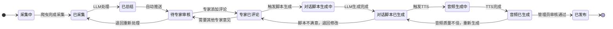
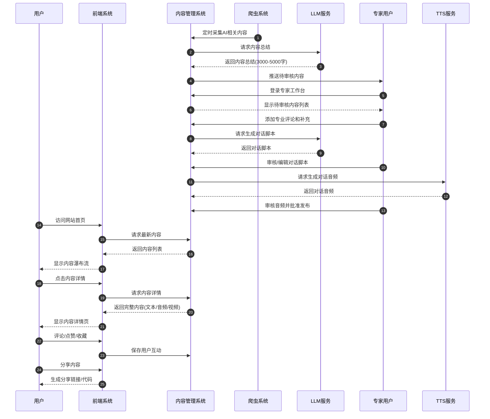
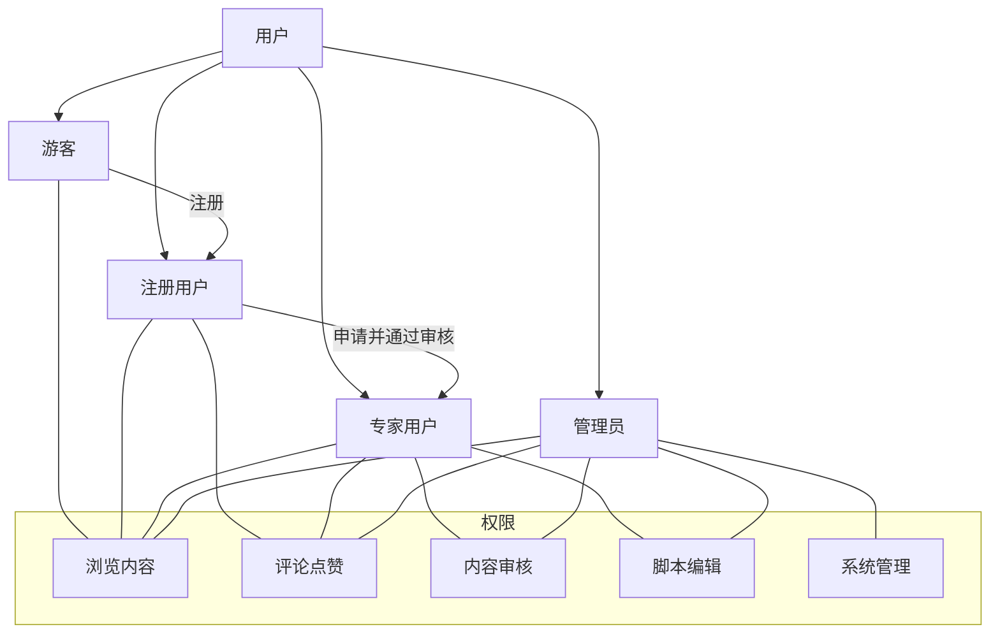

# AI 播客网站项目规划

本博客网站旨在自动整合AI行业的最新热点信息，包括技术革新动态、专家分析解读以及重要观点点评。系统将通过定时任务利用网络爬虫或开放API，从主流科技媒体、自媒体平台（如X.com、YouTube、HackerNews）、投资机构博客和播客等多个渠道抓取最新内容。抓取到的原始资料经过预处理后，利用大型语言模型（LLM，例如 DeepSeek R1）进行分析，总结生成一篇高质量的行业分析报告（约3000-5000字）。 在内容初步生成后，平台会邀请领域专家和特邀嘉宾对报告进行评论和补充，提供专业视角的见解。根据这些专家反馈，系统再次利用LLM将内容扩展为专业讨论的对话脚本（相当于15-50分钟的讨论内容），以2-3人对谈的形式深入探讨该主题。随后，通过文本转语音（TTS）技术将对话脚本合成为多人对话的音频内容，让用户可以通过声音介入这些讨论。 在呈现形式上，网站采用流畅的用户体验设计和瀑布流布局来展示内容，支持文本、音频（以及未来的视频）等多种形式。前端设计注重响应式以适配各种设备，并提供一键切换深色/浅色模式，满足不同用户的阅读偏好。

## 核心思路

创建一个集图文、音频和视频于一体的内容平台，专注于 AI 行业的最新动态、技术革新和专家观点，为投资者、AI科技爱好者、产业研究所等工作人员提供真实的专家级别的服务。该平台将通过以下方式实现价值：

1. **自动化内容采集与整合**：通过爬虫和 API 自动从多渠道收集 AI 领域的热门话题和观点，包括社交媒体、技术博客、播客和视频平台。

2. **AI 驱动的内容处理**：利用大型语言模型（如 Deepseek R1）对采集的信息进行智能分析和总结，生成高质量的内容摘要。

3. **专家参与机制**：邀请领域专家和嘉宾对内容进行评论和补充，增加内容的深度和权威性。

4. **多模态内容生成**：基于原始内容和专家输入，自动生成对话脚本并转化为音频播客，提供多种内容消费方式。

5. **内容状态流转**：建立完整的内容生命周期管理，从采集、总结、专家审核到最终发布，确保内容质量。

6. **用户友好的展示与分享**：以现代化的瀑布流方式展示内容，支持多设备适配和一键分享功能。

## 必要的功能

### 1. 内容采集与处理系统

**内容采集与处理**

系统通过定时任务执行爬虫和API调用，自动抓取各渠道的最新AI行业动态。抓取的原始数据经过清洗和结构化处理，以便后续分析使用。随后利用LLM模型对整理后的内容进行自动总结，提炼其中的热点观点供用户参考。后台还允许手动调整内容采集源；LLM也能根据已有内容推荐新的相关资源，确保信息来源的全面性和准确性。

**专家参与与内容优化**

平台建立专家注册与认证机制，引入具备可信专业背景的领域专家。认证专家可以对AI自动生成的内容发表评论、提出补充，从而把关内容的准确性和深度。系统收集专家的评论反馈，并以此为依据优化后续生成的对话脚本，使讨论更加专业详实。

**多媒体内容生成**

平台支持将文章内容拓展为对话形式并提供音频输出。具体而言，利用LLM将文本内容改写成2～3人参与讨论的对话脚本，然后借助TTS语音合成功能，将该脚本转换为自然流畅的多人对话音频供用户收听。目前平台提供文本和音频两种内容形式，未来计划引入AI生成的视频功能，进一步丰富内容的呈现。

**博客展示与交互**

博客前端提供丰富的展示与互动功能以提升用户体验。首页采用瀑布流布局，将图文、音频（及未来的视频）内容按时间顺序动态排列，方便用户浏览最新发布内容。每篇文章都有独立的详情页，用户可以阅读全文，播放对应的讨论音频，并查看专家评论。互动方面，用户能够分享、收藏、点赞内容或发表评论。平台还提供全文搜索和多条件筛选功能，方便按话题、热度或时间查找感兴趣的内容。

**用户系统**

用户体系划分为普通访客、认证专家和管理员三类角色，并赋予不同权限。未注册访客可以浏览网站内容、收听音频，并使用分享等基础功能；注册专家用户经资质审核后获得评论和内容纠正权限，为平台贡献专业见解。管理员通过后台管理界面配置内容采集参数（如数据源、抓取频率等）、管理专家用户权限，并审核生成内容、进行必要的编辑优化，以保证网站内容质量和运行安全。

- **自动化爬虫系统**：
  - 定时从指定来源（X.com、YouTube、HackerNews、VC 博客等）采集 AI 相关内容
  - 支持自定义信息源添加和管理
  - AI 推荐的信息源智能添加

- **内容分析与总结**：
  - 使用 LLM 对采集内容进行分析和总结（3000-5000字）
  - 关键观点提取和热度排序
  - 多语言内容支持

### 2. 用户管理系统

- **用户角色划分**：
  - 普通用户：浏览、评论、分享内容
  - 专家用户：内容审核、专业评论、参与对话脚本生成
  - 管理员：系统管理、内容审核、用户管理

- **用户认证与权限**：
  - 专家用户认证机制
  - 基于角色的权限控制
  - 用户资料和专业背景展示

### 3. 内容生成系统

- **对话脚本生成**：
  - 基于原始内容和专家输入自动生成 2-3 人对话脚本（15-50分钟）
  - 对话风格定制（深入专业，避免泛泛而谈）
  - 脚本编辑和修改功能

- **音频生成**：
  - 使用 TTS 技术将对话脚本转换为多人对话音频
  - 声音风格和语气调整
  - 音频质量优化

### 4. 内容状态管理

- **工作流程管理**：
  - 内容状态追踪：采集中 → 总结文本 → 专家审核评论 → 对话脚本生成 → 音频生成 → 发布
  - 状态变更通知和提醒
  - 任务分配和截止日期管理

- **审核系统**：
  - 专家内容审核界面
  - 评论和补充输入功能
  - 内容质量评分机制

### 5. 前端展示系统

- **响应式设计**：
  - 适配各种屏幕尺寸（桌面、平板、手机）
  - 兼容主流浏览器

- **多媒体播放**：
  - 集成音频播放器（支持速度调节、章节标记）
  - 视频播放功能
  - 图文轮转展示

- **内容展示**：
  - 瀑布流布局
  - 分类筛选和搜索
  - 个性化推荐

### 6. 互动与分享功能

- **社交互动**：
  - 评论系统
  - 点赞和收藏
  - 用户关注机制

- **分享功能**：
  - 一键分享到主流社交媒体
  - 内容嵌入代码生成
  - 分享数据统计

### 7. 数据分析与反馈

- **内容分析**：
  - 热门话题追踪
  - 用户兴趣分析
  - 内容质量评估

- **用户行为分析**：
  - 访问统计
  - 停留时间和互动率
  - 转化率分析

## App Flow（页面、导航、用户行为）

### 1. 主要页面结构

- **首页**：
  - 顶部导航栏（logo、搜索、登录/注册）
  - 热门话题轮播
  - 最新内容瀑布流展示
  - 分类筛选器
  - 底部信息（关于我们、联系方式、隐私政策等）

- **内容详情页**：
  - 原始内容摘要
  - 专家评论和补充
  - 对话脚本文本
  - 音频/视频播放器
  - 相关推荐
  - 用户评论区
  - 分享按钮

- **用户中心**：
  - 个人资料管理
  - 收藏内容列表
  - 历史浏览记录
  - 专家用户：待审核内容列表
  - 通知中心

- **专家工作台**：
  - 待审核内容列表
  - 审核历史
  - 评论和补充输入界面
  - 对话脚本编辑器
  - 任务日历

- **管理后台**：
  - 内容管理
  - 用户管理
  - 系统设置
  - 数据分析仪表盘
  - 爬虫和信息源管理

### 2. 用户导航流程

首页（瀑布流）：展示最新博客内容卡片（文本摘要和音频播放按钮），以瀑布流形式不断加载，并支持按话题、热度或发布时间筛选内容。
文章详情页：呈现AI自动总结的完整文章内容，页面内嵌音频播放器以播放对话音频。详情页下方提供专家评论区和用户互动操作（评论、点赞、分享）。
专家注册与个人主页：专家通过注册页面提交申请和个人专业信息，经管理员审核通过后获得专家身份。专家的个人主页展示其简介、历史评论及所贡献的内容列表。
后台管理系统：管理员登录后进入后台，可配置内容采集源和调度参数，管理专家用户权限，审阅平台自动生成的内容并执行必要的编辑或维护操作。

#### 普通用户流程

1. **浏览发现**：
   - 访问首页 → 浏览内容 → 筛选感兴趣的类别 → 点击内容详情
   - 搜索特定话题 → 查看搜索结果 → 点击内容详情

2. **内容消费**：
   - 阅读文本摘要 → 查看专家评论 → 收听/观看音频/视频内容
   - 点赞/收藏内容 → 评论互动 → 分享到社交媒体

3. **用户互动**：
   - 注册/登录 → 完善个人资料 → 关注感兴趣的专家和话题
   - 接收新内容通知 → 参与评论讨论

#### 专家用户流程

1. **内容审核**：
   - 登录专家账号 → 进入工作台 → 查看待审核内容列表
   - 选择内容进行审核 → 添加专业评论和补充 → 提交审核结果

2. **内容创作**：
   - 查看生成的对话脚本 → 编辑和优化脚本 → 确认最终版本
   - 审听生成的音频 → 提出修改建议 → 批准发布

3. **专业互动**：
   - 回复用户评论 → 参与专业讨论 → 推荐相关话题

#### 管理员流程

1. **内容管理**：
   - 监控内容状态 → 处理异常情况 → 审核敏感内容
   - 管理信息源 → 调整爬虫参数 → 优化内容采集

2. **用户管理**：
   - 审核专家用户申请 → 分配权限 → 处理用户反馈
   - 监控用户行为 → 处理违规情况

3. **系统维护**：
   - 查看系统性能 → 优化配置 → 更新功能
   - 分析用户数据 → 制定改进策略

### 3. 关键用户行为

- **内容发现**：浏览、搜索、筛选、推荐
- **内容消费**：阅读、收听、观看、下载
- **互动参与**：评论、点赞、收藏、分享
- **专业贡献**：审核、评论、补充、脚本编辑
- **个人管理**：注册、登录、资料更新、偏好设置
- **系统管理**：配置、监控、优化、数据分析

### 4. 状态转换流程

1. **内容生命周期**：
   - 采集中 → 已采集（原始内容）
   - 已采集 → 已总结（LLM 处理后）
   - 已总结 → 待专家审核
   - 待专家审核 → 专家已评论
   - 专家已评论 → 对话脚本生成中
   - 对话脚本生成中 → 对话脚本已生成
   - 对话脚本已生成 → 音频生成中
   - 音频生成中 → 音频已生成
   - 音频已生成 → 已发布

2. **用户状态流转**：
   - 游客 → 注册用户
   - 注册用户 → 活跃用户
   - 活跃用户 → 专家用户（申请并审核通过）

这个项目规划概述了 AI 播客网站的核心思路、必要功能和应用流程，为后续的详细设计和开发提供了基础框架。根据实际开发资源和优先级，可以分阶段实施各个功能模块。 

## 可视化图表

### 内容状态流转图

### App Flow 时序图

### 用户角色与权限关系图

